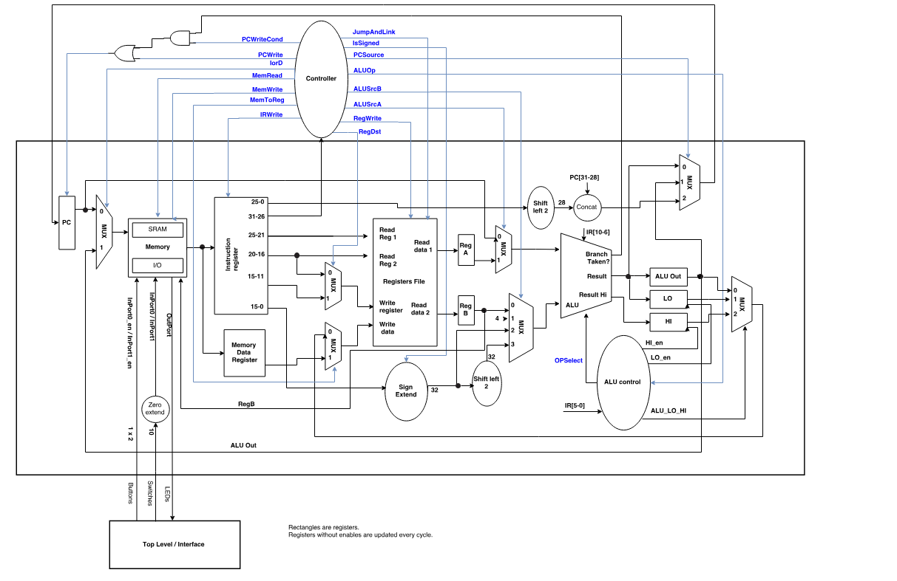

# MIPS Processor
Implementation of a MIPS-like 32 bit processor

### Processor Architecture

### Simulation
Requirements: ModelSim Version 20.1 or later

Setup Steps
1. Clone this repository
2. Open ModelSim
3. Create a new project (file -> new -> project)
4. Give the project a relevant name & location. Leave all other settings as default and click "ok"
5. Click "add existing file" in the window that will pop up
   - If the window doesn't appear or is closed accidentally, right-click in the project tab (which should be open automatically) and click Add to Project -> Existing File
6. Browse to the VHDL directory and select all the files there. Leave all other settings as default and click "ok"
7. Click Compile -> Compile All
   - If they do not all compile successfully, there is likely an issue in the source code, and simulation will likely not work
  
Simulation Steps

1. Click Simulate -> Start Simulation
2. Click the + icon next to "work". Now select the testbench, tb_top_level, and click "ok"
3. In the window that will open, select the signals you would like to observe from the objects window that is likely on the right
    - I recommend selecting clk and button_input(1)(which is the reset button)
4. In the sim window that is likely on the left, ensure that tb_top_level and UUT (Unit Under Test) are both expanded
5. You can now select U_Controller to select which signals in the Objects window you would like to observe
6. You can also expand U_Datapath to select which components in the Datapath you want to observe
7. Please reference the architecture image above to determine which signals and/or components you may want to observe
8. Click Simulate -> Restart or Simulate -> End Simulation when you would like to restart or end the simulation

### Notes
- Docs/Deliverable4.mif is currently the file used for RAM memory initialization and contains the instructions to be executed. Functionality can be verified through simulation

- This project is still under development and may not function as intended at this point in time

